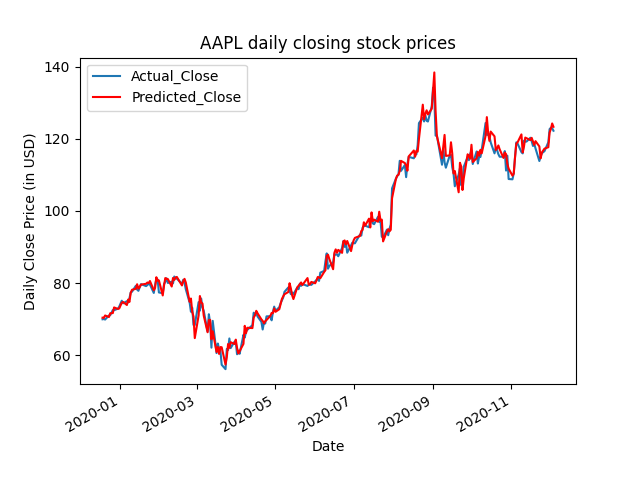

# Stock Market prediction using Hidden Markov Models
This repo contains all code related to my work using Hidden Markov Models to predict stock market prices. This
initially started as academic work, for my masters dissertation, but has since been a project that I have continued to work on 
post graduation. At present, the program must be called from a terminal/ command line, but there is
an aim to extend it to an interactive site in future, potentially via Django.

## Motivation
Hidden Markov Models are an incredibly interesting type of stochastic process that are under utilised in the
Machine Learning world. They are particularly useful for analysing time series. This, combined with their ability to 
convert the observable outputs that are emitted by real-world processes into predictable and efficient models makes
them a viable candidate to be used for stock market analysis. The stock market
has several interesting properties that make modeling non-trivial, namely
volatility, time dependence and other similar complex dependencies. HMMs
are suited to dealing with these complications as the only information they
require to generate a model is a set of observations (in this case historical stock market data).

## Example
Training on and predicting stock prices between January 1st 2018 to December 5th 2020 (the date that this example was ran on), predicting 5 days into the future. Typically the model will need to be trained on longer periods for more accurate results but this is purely to have a simple example.

Input:
```shell
python stock_analysis.py -n AAPL -s 2018-01-01 -e 2020-12-05 -o C:\Users\Jay\Test -p True -f 5 -m True
```

Output:
```shell
Using continuous Hidden Markov Models to predict stock prices for AAPL
Training data period is from 2018-01-02 00:00:00 to 2019-12-17 00:00:00
2020-12-06 17:50:11,202 __main__     INFO     >>> Extracting Features
2020-12-06 17:50:11,203 __main__     INFO     Features extraction Completed <<<
Predicting Close prices from 2019-12-18 00:00:00 to 2020-12-04 00:00:00
100%|██████████████████████████████████████████████████████████████████████████████████████████████████████████████| 244/244 [07:54<00:00,  1.94s/it]
All predictions saved. The Mean Squared Error for the 244 days considered is: 3.7785175769493202
Predicting future Close prices from 2020-12-05 00:00:00 to 2020-12-09 00:00:00
100%|██████████████████████████████████████████████████████████████████████████████████████████████████████████████████| 5/5 [00:09<00:00,  1.92s/it]
The predicted stock prices for the next 5 days from 2020-12-05 are:  [122.99846938775511, 123.75152124114953, 124.50918361609536, 125.27148474027554,
126.0384530141956]
The full set of predictions has been saved, including the High, Low, Open and Close prices for 5 days in the future.
```

Bottom of Excel file (future predictions):

|          Date         |   High   |    Low   |   Open   |   Close  |
|:---------------------:|:--------:|:--------:|:--------:|:--------:|
| 2020-12-03   00:00:00 | 123.78   | 122.21   | 123.52   | 122.94   |
| 2020-12-04   00:00:00 | 122.86   | 121.52   | 122.6    | 122.25   |
| 2020-12-05   00:00:00 | 123.6083 | 122.25   | 122.25   | 122.9985 |
| 2020-12-06   00:00:00 | 124.3651 | 122.9985 | 122.9985 | 123.7515 |
| 2020-12-07   00:00:00 | 125.1265 | 123.7515 | 123.7515 | 124.5092 |
| 2020-12-08   00:00:00 | 125.8926 | 124.5092 | 124.5092 | 125.2715 |
| 2020-12-09   00:00:00 | 126.6634 | 125.2715 | 125.2715 | 126.0385 |

The full table contains all of the test data, in this case from 2019-12-18 to 2020-12-04 as well as the final 5 days in the future, 2020-12-04 to 2020-12-09.

Plot:


## Dependencies
* Pandas_datareader - Allows one to download data directly from Yahoo finance
* NumPy - Required for fast manipulation of financial data (e.g. calculating fractional change)
* Matplotlib - Required for visualisation of results
* Hmmlearn - Open source package that allows for creation and fitting of HMM's 
* Sklearn - Used to calculate metrics to score the results and split the data, will be removed in future to reduce dependency
* Tqdm - Used to track progress whilst training
* Argparse - Required for console inputs

## Method
Stock market data is downloaded via pandas_datareader and the data is split into training and testing datasets. The 
fractional changes for any given day (from open to close, high to open, open to low) in the training dataset are computed and stored in a NumPy 
array. These fractional changes can be seen as the observations for the HMM and are used to train the continuous HMM 
with hmmlearn's fit method. The model then predicts the closing price for each day in the training dataset, based on the given 
days opening price. This prediction is found by calculating the highest scoring potential outcome out of a pre-determined 
set of outcomes (e.g. +0.001%, -0.001% etc). All predictions as well as the actual close prices for the testing period are stored in an 
excel file and the Mean Squared Error between the two is printed out. The MSE is also included in the file name for future 
reference. Future days are predicted by feeding forward the prediction values. Unfortunately, at present there is no method in place to account for overnight/ weekend futures trading, and so for the future predictions the n+1 days open price is the same as the nth days closing price. 

## Installation

### Linux
```shell
sudo apt-get install libopenjp2-7 libtiff5
pip install -r requirements.txt
```

## Usage 
```shell
python stock_analysis.py [-n XXXX] [-s yyyy-mm-dd] [-e yyyy-mm-dd] [-o dir] [-p T/F] [-f int] [-m T/F]
```
The -n input represents a given stock name, -s is the start date of the period considered, -e is the end date of the period considered 
and -o takes in the output directory for the excel file produced. It is important that the dates are input in the correct
order. -p is a boolean input that tells the script whether or not to plot the historical dates, it will have no effect if -m is not also set to true. 
-f stands for future and takes in an integer that determines how many days into the future the user would like to predict. 
-m stands for metrics, and determines whether or not to predict for the historical data, or just for the future days, if True all of the historical data in the
test set will be predicted and the Mean Squared Error will be returned. The justification for -m being an optional input is that the model can take quite some time to 
predict, so it's best if the user has the option to just predict the close prices for x future days quickly as that is the information that many people will find most 
useful. 
